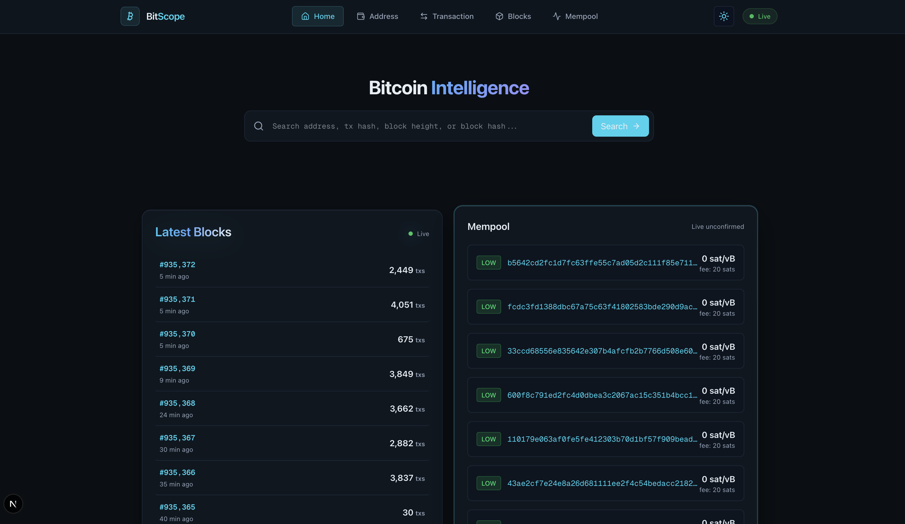
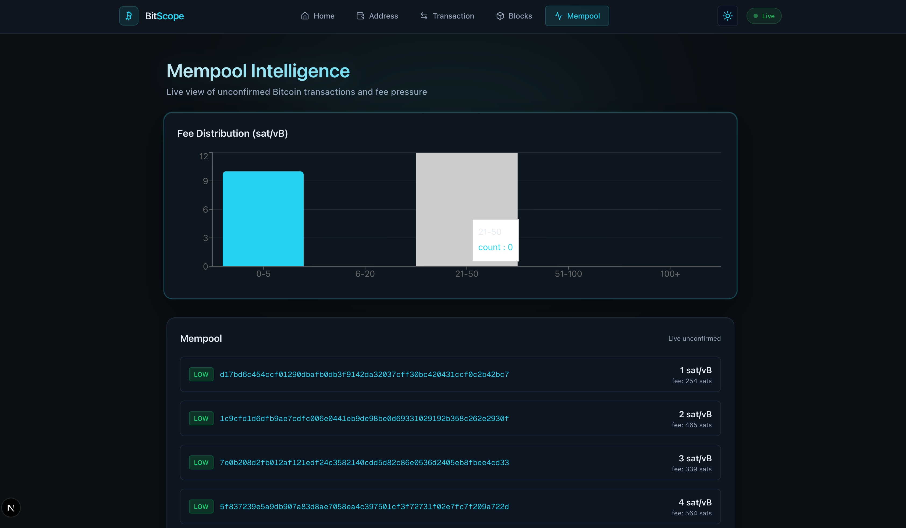
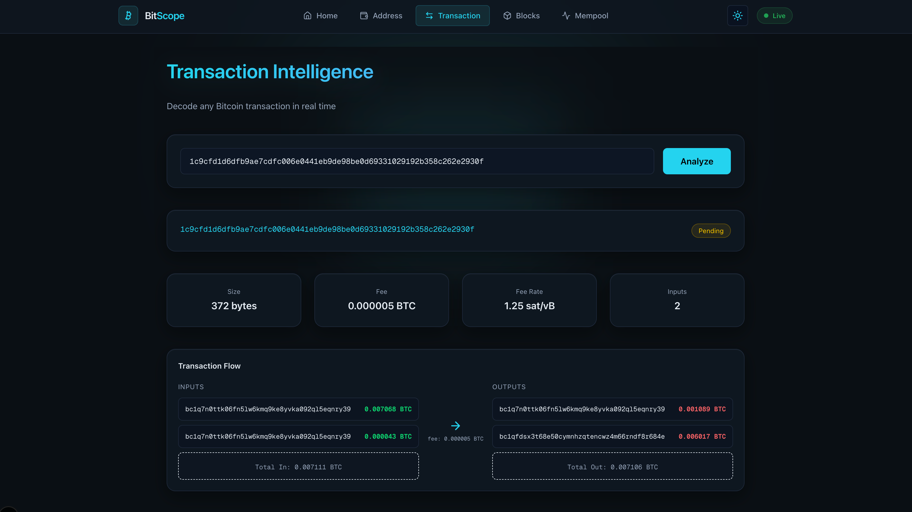

# BitScope — Visual Bitcoin Explorer & Intelligence Dashboard

**A modern Bitcoin explorer that transforms raw blockchain data into an interactive intelligence dashboard.**


---

## Live Demo

Frontend: https://bitscope-256skboh-samiksha-tiwari-projects.vercel.app
Backend: https://bitscope-server.onrender.com

---

## Overview

BitScope reimagines how Bitcoin data is explored. Instead of dense tables and raw hexadecimal data, it presents transaction flow, address behavior, mempool dynamics, and block activity through a clean, responsive interface.

Powered by the Blockstream public API and built with a modern frontend stack, BitScope feels like a Bitcoin intelligence dashboard rather than a traditional block explorer.


---

## Screenshots

### Home Dashboard


### Mempool Intelligence


### Transaction View



---

## Key Features

### Transaction Intelligence
- Visual input → output flow
- Fee, size, fee-rate, and confirmation status
- Instant examples from live mempool transactions

### Address Intelligence
- BTC received vs spent overview
- Recent transaction history
- Behavioral risk scoring heuristic
- Wallet activity summary

### Block Explorer
- Real-time latest blocks feed
- Block height navigation
- Block statistics dashboard

### Mempool Intelligence
- Live unconfirmed transactions
- Fee priority classification (Low / Medium / High)
- Fee distribution chart (sat/vB buckets)

### UI / UX
- Glassmorphism card design
- Dark / Light theme toggle
- Fully responsive layout
- Tailwind v4 design tokens

---

## Tech Stack

| Layer        | Technology                             |
|-------------|-----------------------------------------|
| Framework   | Next.js 16 (App Router, Turbopack)     |
| Language    | TypeScript (strict mode)               |
| Styling     | Tailwind CSS v4                        |
| Charts      | Recharts                               |
| Icons       | Lucide                                 |
| Data Source | Blockstream Bitcoin API                |

---

## Architecture

    app/
    components/
      
---

## Data Flow

Browser → Next.js → Blockstream API

BitScope focuses on transforming raw blockchain responses into structured, human-readable visual dashboards without overwhelming the user with raw data tables.

---


## Getting Started


## Running BitScope Locally (Frontend + Backend)

BitScope consists of:

- **Frontend** — Next.js dashboard
- **Backend** — Express API that normalizes Blockstream data

Both must run together.

---

### 1) Start the Backend Server(Local)

```bash
git clone https://github.com/samiksha-tiwari1/bitscope-server.git
cd bitscope-server
npm install
node server.js
  ```

Backend runs at: http://localhost:4000


### 2) Start the Frontend Server(Local)

```bash
git clone https://github.com/samiksha-tiwari1/bitscope.git
cd bitscope
pnpm install
```

### Create a .env.local file in the root:


NEXT_PUBLIC_API_URL=http://localhost:4000

```bash
pnpm dev
```

Frontend runs at: http://localhost:3000


---

## Environment Variables (Production / Deployed)

Create a `.env.local` file:

NEXT_PUBLIC_API_URL=https://bitscope-server.onrender.com

---

## Deployment

Frontend deployed on Vercel.  
Backend deployed on Render.

---


## Usage Examples

You can explore BitScope by searching:

- **Block height:** 840000
- **Any transaction hash**
- **Bitcoin Genesis address:** 1A1zP1eP5QGefi2DMPTfTL5SLmv7DivfNa

---

## Future Improvements

- Address clustering heuristics
- Whale movement detection
- Historical fee trend analysis
- Export transaction graph as image
- Lightning Network statistics
- Performance caching layer

---


## Contributing

Contributions are welcome.

1. Fork the repository
2. Create a feature branch
3. Submit a pull request with a clear description

Ensure code is typed, formatted, and consistent with the existing structure.

---

## Author

**Samiksha Tiwari**  
Computer Science Student 